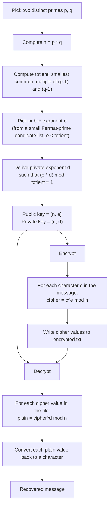
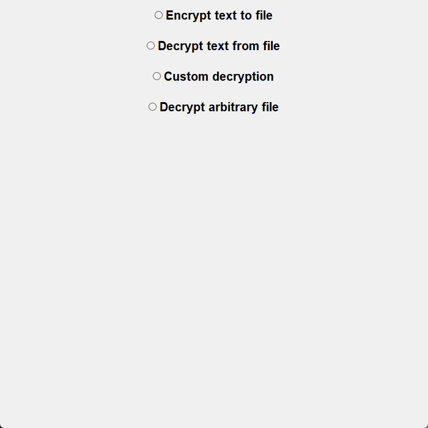
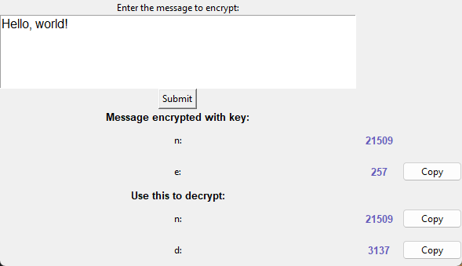
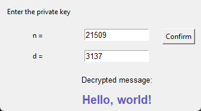

# RSA

A from-scratch implementation of the RSA public-key cryptosystem in Python — no `pycryptodome`, no `cryptography`, no `rsa` package. Key generation, encryption, and decryption are all hand-written using plain modular arithmetic, wrapped in a small Tkinter GUI.

I built this to take RSA out of the textbook and put it into working code — turning the theory (prime selection, totients, modular inverses, modular exponentiation) into a program I could run, break, and visualize step by step. Seeing a keypair actually get generated and a message get encrypted and decrypted end-to-end made the math click in a way that reading about it never did.

## How it works



## GUI

The app opens a simple menu with four options; two are implemented end-to-end, two are stubs (see [Known limitations](#known-limitations)).

### Main menu



### Encrypting a message

Generates a fresh keypair, encrypts the input, and displays both the public key (used to encrypt) and the private key (needed to decrypt):



### Decrypting a message

Takes the private key (`n`, `d`) and recovers the original text from `encrypted.txt`:



## Running it

Requires Python 3 with Tkinter (bundled with most Python installs) and `pyperclip`:

```bash
pip install pyperclip
python main.py
```

Select **"Encrypt text to file"**, type a message, and submit — this generates a keypair, encrypts the message into `encrypted.txt`, and shows you the public/private key values. Then select **"Decrypt text from file"** and enter the `n`/`d` values shown to recover the message.

## Known limitations

This is a learning project, not a cryptographic library — it is **not safe for real-world use**:

- **Trivially small primes**: `p` and `q` are drawn from the range 100–200, so `n` is small enough to factor instantly. Real RSA uses primes hundreds of digits long.
- **No padding scheme**: plaintext is encrypted byte-by-byte with textbook RSA (`c = m^e mod n`), with no OAEP or similar padding. This makes it vulnerable to standard textbook-RSA attacks (deterministic ciphertexts, no semantic security).
- **Small, fixed exponent pool**: `e` is chosen from a hardcoded list of Fermat primes rather than validated against `p`/`q` at generation time.
- **Naive primality/inverse search**: prime discovery and modular inverse lookup are done by brute-force loops rather than proper primality testing (e.g. Miller-Rabin) or the extended Euclidean algorithm.
- **Two GUI menu options are unfinished**: "Custom decryption" and "Decrypt arbitrary file" currently just open an empty placeholder window — the logic behind them hasn't been implemented yet.

These trade-offs are intentional: the goal was to expose the RSA math clearly, not to ship production crypto. For real applications, use an audited library and a properly padded scheme (e.g. RSA-OAEP) with key sizes of 2048 bits or larger.

## Project structure

- `main.py` — RSA key generation, encryption/decryption logic, and the Tkinter GUI
- `messageFormat.bat` / `messageFormat.sh` — strip formatting characters (`[`, `]`, `,`) from the raw cipher output so `encrypted.txt` holds plain space-separated integers
- `encrypted.txt` — generated at runtime, holds the current ciphertext (gitignored)
